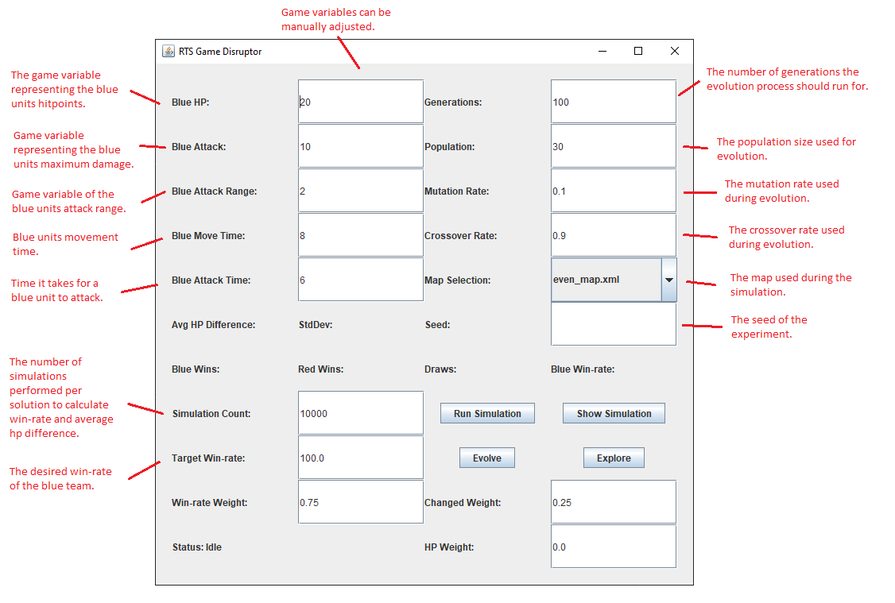
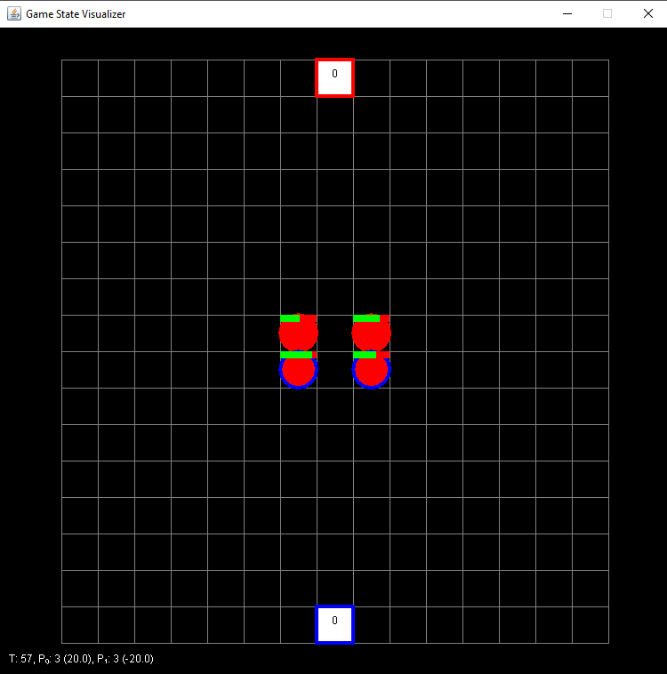
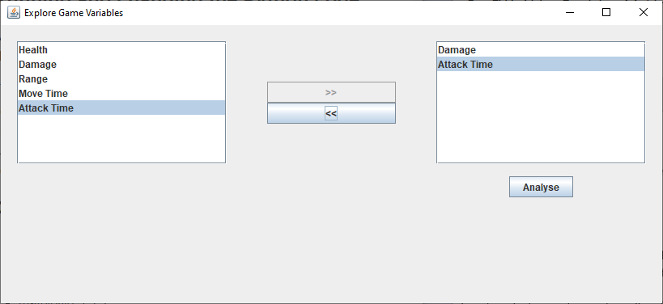
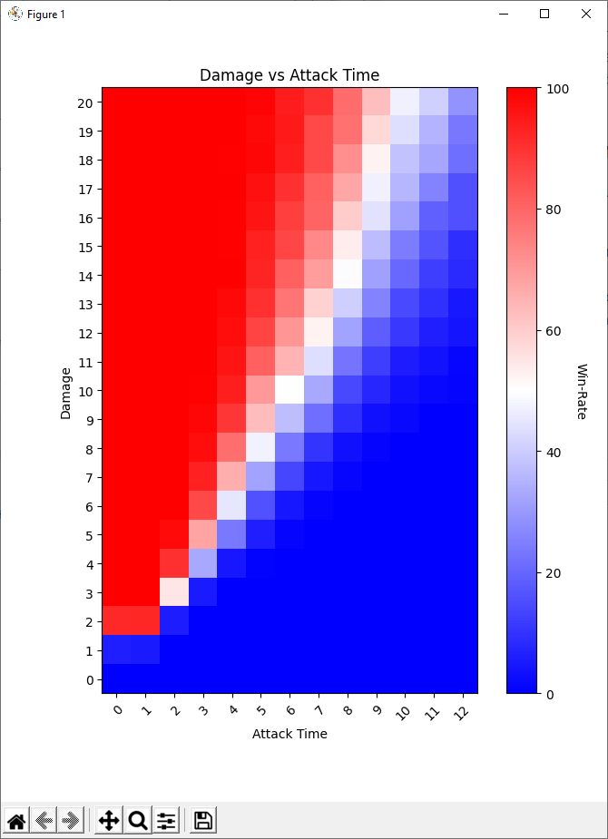

# RTS Game Disruptor

RTS Game Disruptor is a simple prototype designed to allow manual, semi-automated and fully automated exploration of game variables impact on a games balance. The RTS game chosen for disruption was [microRTS](https://github.com/santiontanon/microrts) as it is simple and designed for AI research. The prototype uses evolution to explore a small set of microRTS game variables and provides the ability to graph and visualize variables impact on game balance.

## How to run the prototype

The simplest way to run the prototype is to use the pre-built executable under the **"dist\prototype\\"** directory. Double-clicking the **prototype.exe** on windows will run the prototype provided that [Java](https://www.java.com/en/download/manual.jsp) is installed on the machine.

## How to use the prototype

Below is an annotated screenshot of the prototype main GUI.

The **Run Simulation** button performs the specified number of simulations in the simulation count field to calculate the game balance for a given set of game variables.

The **Show Simulation** button performs a single simulation of a solution and shows the result to the user.

The **Evolve** button starts the evolution process which runs until the specified number of generations have been completed. The game variables input fields (Blue HP, Blue Attack, Blue Attack Range, Blue Move Time and Blue Attack Time) are updated to the current best solution as the evolution process runs.

The **Explore** button shows a UI that allows a user to select one or two game variables to visualize there impact on game balance. The process requires running many simulations and can take long time depending on the number of simulations set in the simulation count setting.

The hall of fame and fitness graph of the evolution process can be found in the  **"experiments\\"** directory of either the prototype folder or the code base folder depending on how the tool was run.

## How to build and make changes

The prototype uses two programming languages, Python for the evolution process and Java for the GUI and rts simulation. The project is structured so that Python code base creates a process that runs and communicates with the java code.

### Running and changing the Python code

All of the python code for the evolution process is contained in a single file called **main.py**

The code makes use of the Python DEAP framework to evolve a set of game variables to be sent to the Java process for evaluation. The project was developed using Python 3.8 however its possible it can be run using older versions of Python. Below are a list of all the dependancies that are required.

#### Dependancies

- Python 3.8
- Numpy 1.20.1
- DEAP 1.3.1
- matplotlib 3.3.3
- pyinstaller 4.2
- Java Runtime JRE 8

With all of the dependancies installed the python code can be run by using the following command:

`python main.py`

The python code requires that there be a MicroRTS.jar, even_map.xml and red_map.xml in its directory.

### Running and changing the Java code

All of the java code for the GUI and simulation is contained in a single file called **GameDisruptor.java**

In order to make changes to the GUI or the simulation, the [MicroRTS](https://github.com/santiontanon/microrts) framework is required. The GameDisruptor.java file must be placed under the **"src\tests\\"** directory. Then follow the instructions on the MicroRTS github page to build a new MicroRTS.jar file and copy it into the directory with the python main.py

To view the changes made, follow the instructions above to run the python **main.py** file.

### Packaging the code into prototype executable

In the directory of the python code base use the command:

`pyinstaller --clean main.spec`

This will start packaging up the python and java code into an executable that doesn't require python be installed on the target machine in-order to use it. The packaged executable still requires that the machine have Java.

Choose yes (y) when the command prompts you whether you would like to clean out the folder of the existing prototype.

The final executable can be found in the **"dist/prototype"** directory.